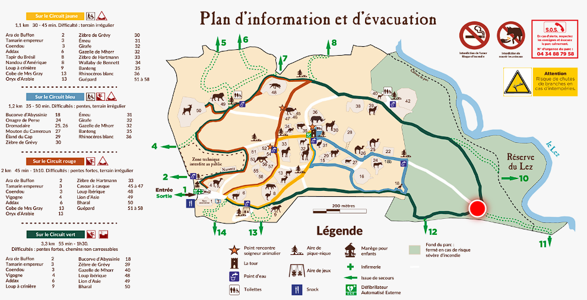

# Lunaret Map

Application web pour mobile permettant d'afficher la position de l'utilisateur sur le plan du Zoo du Lunaret. L'application utilise le GPS de l'appareil afin de géolocaliser l'utilisateur et afficher un point rouge sur le plan à l'endroit où il se trouve. On peut ainsi se promener dans le zoo sans jamais se perdre.

L'utilisateur doit autoriser l'application à accéder à sa position GPS pour qu'elle apparaisse sur le plan. Toutefois, si l'utilisateur ne le souhaites pas, alors il peut utiliser l'application pour uniquement afficher la carte.

Version live ici : https://bnobo.github.io/LunaretMap/www/

## Technologies utilisées

- HTML
- CSS
- JavaScript

## Fonctionnalités

- Affichage du plan du Zoo du Lunaret
- Affichage de la position GPS de l'utilisateur sur le plan
- Possibilité de zoomer et dézoomer sur le plan

